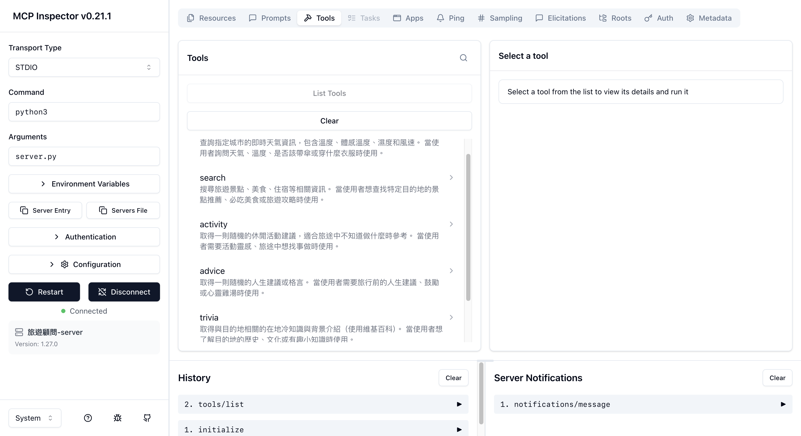

# MCP Server + AI agent 分組實作

> 課程：AI Agent 開發 — MCP（Model Context Protocol）
> 主題：旅遊顧問 MCP Server

---

## Server 功能總覽

> 這個 MCP Server 是一個「旅遊顧問」，提供天氣查詢、景點搜尋、國家資訊、活動推薦等旅行前必備功能。

| Tool 名稱            | 功能說明                     | 負責組員 |
| -------------------- | ---------------------------- | -------- |
| `get_weather`        | 查詢目的地即時天氣            | 陳柏宇   |
| `web_search`         | 搜尋景點、美食、旅遊攻略      | 楊承軒   |
| `get_activity`       | 推薦可以做的活動              | 陳婉榕   |
| `get_advice`         | 取得旅行前的人生建議          | 陳婉榕   |
| `get_fun_fact`       | 取得隨機趣味冷知識            | 陳婉榕   |
| `get_trivia`         | 旅途知識問答                  | 林永富   |
| `get_country_info`   | 查詢國家旅遊基本資訊          | 林永富   |

---

## 組員與分工

| 姓名   | 負責功能                              | 檔案                          | 使用的 API                    |
| ------ | ------------------------------------- | ----------------------------- | ----------------------------- |
| 陳柏宇 | get_weather                           | `tools/weather_tool.py`       | wttr.in                       |
| 楊承軒 | web_search                            | `tools/search_tool.py`        | duckduckgo-search             |
| 陳婉榕 | get_activity / get_advice / get_fun_fact | `tools/activity_tool.py` 等 | Bored API / Advice Slip / Useless Facts |
| 林永富 | get_trivia / get_country_info         | `tools/trivia_tool.py` 等    | Open Trivia / REST Countries  |
| 洪紹禎 | Resource + Prompt + Agent             | `server.py` / `agent.py`     | Gemini 2.5 Flash              |

---

## 專案架構

```
├── server.py                  # MCP Server 主程式（SSE 模式）
├── agent.py                   # MCP Client + Gemini Agent
├── tools/
│   ├── __init__.py
│   ├── weather_tool.py        # 天氣查詢（陳柏宇）
│   ├── search_tool.py         # 景點美食搜尋（楊承軒）
│   ├── activity_tool.py       # 推薦活動（陳婉榕）
│   ├── advice_tool.py         # 人生建議（陳婉榕）
│   ├── fun_fact_tool.py       # 趣味冷知識（陳婉榕）
│   ├── trivia_tool.py         # 知識問答（林永富）
│   └── country_info_tool.py   # 國家資訊（林永富）
├── requirements.txt
├── .env.example
├── .gitignore
└── README.md
```

---

## 使用方式

```bash
# 1. 建立虛擬環境
python3 -m venv .venv
source .venv/bin/activate

# 2. 安裝依賴
pip install -r requirements.txt

# 3. 設定 API Key
cp .env.example .env
# 編輯 .env，填入你的 GEMINI_API_KEY

# 4. 用 MCP Inspector 測試 Server（推薦：repo 內建的一鍵啟動）
./open_inspector.command

# 或者不用腳本，直接使用 repo 內的 Inspector config：
npx @modelcontextprotocol/inspector --config inspector.json

# 如果你偏好 mcp CLI：
mcp dev server.py

# 5. 用 Agent 對話（推薦：stdio 模式，一個終端機即可）
python agent.py

# 6. 如果你想保留原本「分開啟動 Server + Agent」的方式，改用 SSE：
# 終端機 1：
python server.py --transport sse --host localhost --port 8000
# 終端機 2：
python agent.py --transport sse
```

> 注意：MCP Inspector v0.21.1 的 UI 本身不會自動按下 Connect。
> `open_inspector.command` 會幫你把 server 設定好，打開後直接按 Connect 就能成功，不需要再手填 SSE URL。

---

## 測試結果

### MCP Inspector 截圖



### Agent 對話截圖


---

## 各 Tool 說明

### `get_weather`（負責：陳柏宇）

- **功能**：查詢指定城市的即時天氣（溫度、體感、濕度、風速）
- **使用 API**：`https://wttr.in/{city}?format=j1`
- **參數**：`city: str` — 城市名稱
- **回傳範例**：

```
Taipei 天氣
溫度：22°C
體感：25°C
天氣：Partly Cloudy
濕度：78%
風速：11 km/h
```

### `web_search`（負責：楊承軒）

- **功能**：搜尋旅遊景點、美食、住宿等相關資訊
- **使用 API**：`duckduckgo-search` 套件
- **參數**：`query: str` — 搜尋關鍵字
- **回傳範例**：前 5 筆搜尋結果（標題 + 摘要 + 連結）

### `get_activity`（負責：陳婉榕）

- **功能**：推薦一個可以做的活動
- **使用 API**：`https://bored-api.appbrewery.com/random`
- **參數**：無
- **回傳範例**：

```
活動：Learn to play a new instrument
類型：music
參與人數：1
```

### `get_advice`（負責：陳婉榕）

- **功能**：取得一則隨機人生建議
- **使用 API**：`https://api.adviceslip.com/advice`
- **參數**：無
- **回傳範例**：`"Never regret. If it's good, it's wonderful. If it's bad, it's experience."`

### `get_fun_fact`（負責：陳婉榕）

- **功能**：取得一則隨機趣味冷知識
- **使用 API**：`https://uselessfacts.jsph.pl/api/v2/facts/random`
- **參數**：無
- **回傳範例**：`"The shortest war in history was between Zanzibar and England in 1896."`

### `get_trivia`（負責：林永富）

- **功能**：取得一則隨機知識問答（含問題、答案、類別和難度）
- **使用 API**：`https://opentdb.com/api.php?amount=1`
- **參數**：無
- **回傳範例**：

```
類別：Geography
難度：medium
問題：What is the capital of Australia?
答案：Canberra
```

### `get_country_info`（負責：林永富）

- **功能**：查詢指定國家的旅遊基本資訊（首都、貨幣、語言、時區）
- **使用 API**：`https://restcountries.com/v3.1/name/{country}`
- **參數**：`country: str` — 國家名稱（英文）
- **回傳範例**：

```
🌍 Japan 旅遊資訊
首都：Tokyo
地區：Asia / Eastern Asia
人口：125,836,021
貨幣：Japanese yen（¥）
語言：Japanese
時區：UTC+09:00
```

---

## 心得
> 陳婉榕：在開發過程中，我透過串接 Bored API、Advice Slip API 以及 Useless Facts API，學會了如何將外部資源封裝進系統裡，並撰寫精確的函數說明，讓模型能清楚判斷各自的調用情境。看到這些原本只會傳回簡單字串的 API 資料，在經過 MCP 架構整合後，被 AI 巧妙且自然地融入到聊天之中，不管是在旅途中分享趣味冷知識、提供活動靈感來解決無聊，還是給予充滿溫度的建議，看到成果的瞬間非常有成就感。


### 遇到最難的問題

> 林永富：這次實作遇到最困難的部分是如何把從上週獨立開發的 Tool，全部整合進 FastMCP 的註冊系統裡。因為原本的架構大家是寫死在主程式，現在要透過 `@mcp.tool()` 來統一介面讓 Agent 辨識。我們解決的方式是，先規劃好每個 Tool 必須要有獨立的 return string，不處理任何互動邏輯，只要維持單純的 input/output。此外，`agent.py` 如何把伺服器的 MCP Tool schema 解析成 Gemini function declaration 也是一大挑戰，後來參考了老師的指引與使用迴圈一一對應 type 才成功。

> 洪紹禎：這次實作中，最具挑戰性的部分在於如何讓 Gemini Agent 正確與 MCP Server 進行對話。處理連接設定，尤其是理解 SSE 或 stdio 的底層傳輸模式，以及將 MCP 提供的 Tool Schema 轉換為 Gemini API 可以接受的格式，需要十分細心。此外，要設計良好的 System Prompt 確保大語言模型能根據用戶需求精準挑選工具、並妥善把各個工具的回傳結果統合成自然的最終回答，也經過了多次的反覆測試。
> 陳婉榕： 這次實作遇到最難的問題是"Tool 函數說明"的精準度測試。原本以為程式碼寫對、資料抓下來就結束了，後來才發現如何讓 AI 知道要在什麼時機點調用工具才是最困難的。如果註解寫得太模糊，Gemini Agent 就會搞混 activity 和 funfact 的使用時機。我必須反覆修改描述，精確寫下「當使用者需要建議時...」或「當需要解決無聊時...」，才能成功引導模型在最對的話題中觸發它，這過程就像是在對 AI 下指令一樣，需要不斷測試與微調。

### MCP 跟上週的 Tool Calling 有什麼不同？

> 林永富：做完這次實作後，我深刻體會到 MCP (Model Context Protocol) 帶來的高度解耦與擴展性。上週的 Tool Calling，我們必須把 API 取得邏輯與呼叫大模型的程式碼「綁定」在同一個專案或腳本中。我們需要自己維護所有的函式定義，如果 Tool 增加，大模型的 prompt 或 function list 就要手動寫死。然而，引入 MCP Server 後，**Tool 完全獨立於 Agent 之外**。Agent 就像客戶端，它只要連上 SSE (或 STDIO)，詢問「你有什麼能力？」，MCP Server 就會自動發出標準化的 JSON 宣告。這意味著，未來如果我想用別的模型（如 Claude 或其他大模型），我不需要重寫任何與天氣、查詢等有關的程式碼，只要換一個有配合 MCP 標準的 AI Client 即可。簡單來說：**上週是「把工具塞給 AI」，這週 MCP 是「把工具做成伺服器，讓 AI 自己來要」**。這種標準化的架構讓開發與維護變得非常乾淨俐落！
---
> 洪紹禎：從 Agent 開發者的角度來看，最大的突破在於「動態探索」與「職責分離」。以前實作 Tool Calling 時，必須在 Agent 程式碼中寫死所有的 function definitions，一旦工具增減變動，甚至只改個參數，Agent 這邊也必須同步修改。而有了 MCP 標準後，Agent 變成一個純粹的「大腦與中控台」，它可以自動去 Server 請求現有工具的目錄；無論 Server 掛載了什麼新工具，Agent 都能無縫接軌並提供給模型使用。這讓整體的系統擴充變得毫無負擔，是走向通用型 AI 助理的重要一步。
---
> 陳婉榕：上週我們做傳統的 Tool Calling 時，除了把工具的邏輯寫出來，還必須自己手動把 Python function 轉換成符合大語言模型規定的 JSON Schema 格式，Agent 才能看得懂，這讓寫功能和串接模型綁得死死的。但在引入 MCP 之後，我發現我根本不需要去管 Gemini 的 API 長怎樣、或是需要什麼特殊的資料結構。我只要專心把 activity 跟 advice 的 Python 邏輯寫好，最後加上一行 @mcp.tool() 裝飾器，工作就結束了！MCP Server 就像一個自動翻譯機，幫我把寫好的工具轉換成標準規格，讓前台的 Agent 自己來取用。寫工具的人不用懂 AI 底層，做 Agent 的人不用管工具怎麼寫，開發效率變得比較高。
